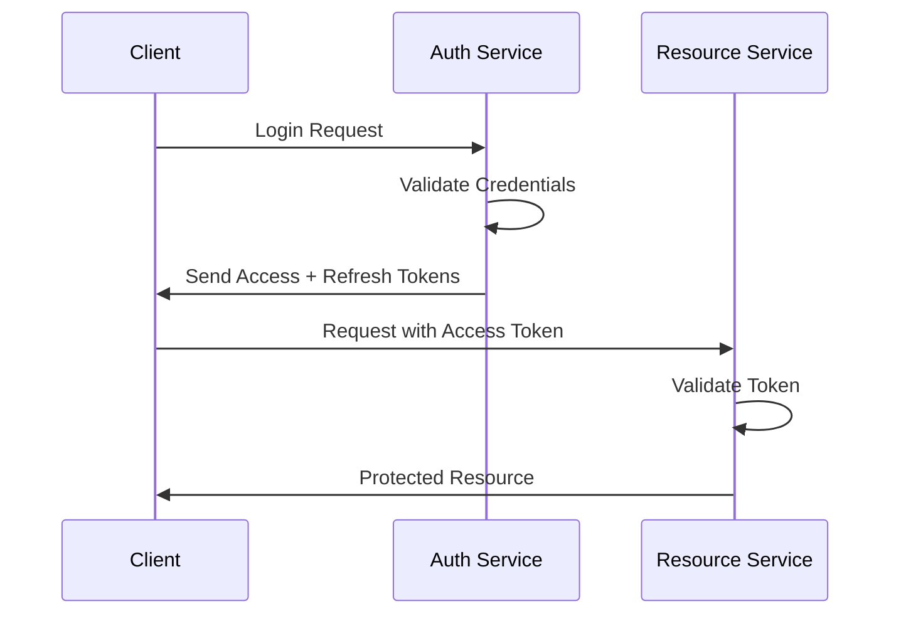
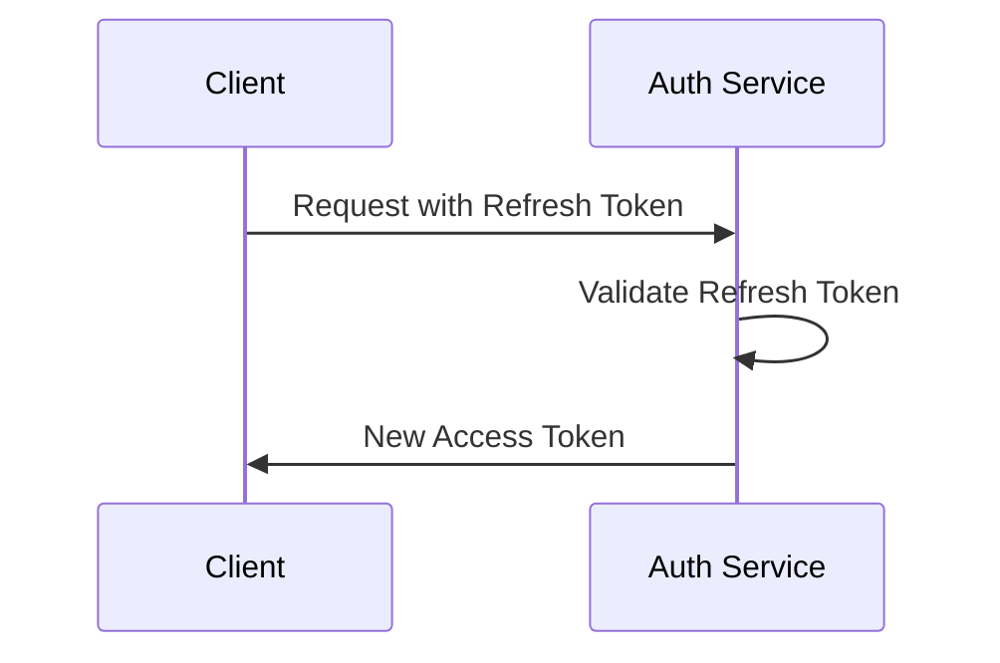

# Authentication Best Practices

## Overview
This document outlines the JWT-based authentication implementation used across our microservices architecture. JWT (JSON Web Tokens) was chosen to enable centralized authentication while allowing distributed service-to-service communication.

## JWT Implementation

### Token Structure
```json
{
  "header": {
    "alg": "RS256",
    "typ": "JWT"
  },
  "payload": {
    "sub": "user_id",
    "role": ["admin", "user"],
    "iat": 1516239022,
    "exp": 1516242622,
    "iss": "bawes-erp-auth"
  }
}
```

### Token Types

1. **Access Token**
   - Short-lived (15-60 minutes)
   - Used for API authentication
   - Contains user permissions and roles
   - Stateless validation

2. **Refresh Token**
   - Long-lived (7-30 days)
   - Stored securely in HTTP-only cookies
   - Used to obtain new access tokens
   - Can be revoked server-side

## Security Considerations

### Token Storage
- Access tokens: Store in memory (never in localStorage)
- Refresh tokens: HTTP-only, secure cookies
- Use appropriate CORS policies

### Best Practices
1. Use RS256 (asymmetric) over HS256
2. Implement token rotation
3. Include only necessary claims
4. Set appropriate expiration times
5. Implement token blacklisting for critical scenarios

### Headers
```typescript
Authorization: Bearer <access_token>
```

## Implementation Guide

### 1. Authentication Flow


### 2. Token Refresh Flow


## Microservices Integration

### Service-to-Service Authentication
1. Use service accounts with specific roles
2. Implement mutual TLS where possible
3. Use dedicated service tokens

### Validation Middleware
```typescript
import { verify } from 'jsonwebtoken';

const authMiddleware = async (req, res, next) => {
  try {
    const token = req.headers.authorization?.split(' ')[1];
    if (!token) throw new Error('No token provided');
    
    const decoded = verify(token, PUBLIC_KEY, { algorithms: ['RS256'] });
    req.user = decoded;
    next();
  } catch (error) {
    res.status(401).json({ error: 'Unauthorized' });
  }
};
```

## Error Handling

### Common Error Scenarios
1. Token Expired
2. Invalid Signature
3. Missing Token
4. Insufficient Permissions

### Error Responses
```json
{
  "error": {
    "code": "AUTH_ERROR",
    "message": "Token has expired",
    "status": 401
  }
}
```

## Security Checklist

- [ ] Implement rate limiting
- [ ] Use secure password hashing (Argon2 or bcrypt)
- [ ] Enable CSRF protection
- [ ] Set secure cookie attributes
- [ ] Implement audit logging
- [ ] Regular security reviews
- [ ] Token rotation strategy
- [ ] Proper error handling
- [ ] Input validation
- [ ] XSS protection headers

## Environment Variables

```env
JWT_ACCESS_TOKEN_SECRET=<your-secret>
JWT_REFRESH_TOKEN_SECRET=<your-secret>
JWT_ACCESS_TOKEN_EXPIRY=15m
JWT_REFRESH_TOKEN_EXPIRY=7d
```

## Testing

### Unit Tests
- Token generation
- Token validation
- Refresh flow
- Error scenarios

### Integration Tests
- Authentication flow
- Authorization checks
- Token refresh
- Error handling

## Monitoring and Logging

### Key Metrics
- Failed authentication attempts
- Token refresh rate
- Authentication latency
- Active sessions

### Audit Logs
- Login attempts
- Token refreshes
- Permission changes
- Security events

## References
- [JWT.io](https://jwt.io/)
- [OWASP Authentication Cheatsheet](https://cheatsheetseries.owasp.org/cheatsheets/Authentication_Cheat_Sheet.html)
- [OAuth 2.0 Best Practices](https://oauth.net/2/) 