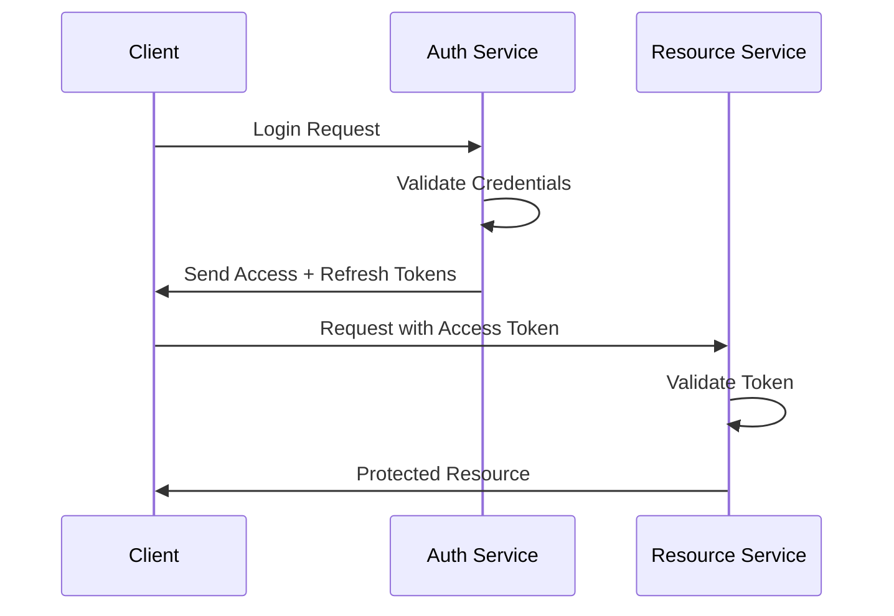

# Phase 1: Core Authentication

## Overview
This phase implements the fundamental JWT-based authentication system with access and refresh tokens.

## Core Features

### 1. JWT Implementation
- Access tokens (short-lived, 15-60 minutes)
- Refresh tokens (long-lived, 7-30 days)
- Asymmetric signing (RS256)
- Secure token storage

### 2. Token Structure
```json
{
  "header": {
    "alg": "RS256",
    "typ": "JWT"
  },
  "payload": {
    "sub": "user_id",
    "role": ["admin", "user"],
    "iat": 1516239022,
    "exp": 1516242622,
    "iss": "bawes-erp-auth"
  }
}
```

### 3. Token Management
```typescript
interface TokenPair {
  accessToken: string;
  refreshToken: string;
}

interface TokenPayload {
  sub: string;
  iat: number;
  exp: number;
  iss: string;
}
```

### 4. Security Implementation
- HTTP-only cookies for refresh tokens
- Memory-only storage for access tokens
- CORS configuration
- Token blacklisting
- Rate limiting

### 5. Authentication Flow


### 6. Validation Middleware
```typescript
import { verify } from 'jsonwebtoken';

const authMiddleware = async (req, res, next) => {
  try {
    const token = req.headers.authorization?.split(' ')[1];
    if (!token) throw new Error('No token provided');
    
    const decoded = verify(token, PUBLIC_KEY, { algorithms: ['RS256'] });
    req.user = decoded;
    next();
  } catch (error) {
    res.status(401).json({ error: 'Unauthorized' });
  }
};
```

## Implementation Checklist
- [ ] JWT token generation and validation
- [ ] Access token middleware
- [ ] Refresh token rotation
- [ ] Error handling
- [ ] Security headers
- [ ] Rate limiting
- [ ] Basic testing suite

## Configuration
```env
JWT_ACCESS_TOKEN_SECRET=<your-secret>
JWT_REFRESH_TOKEN_SECRET=<your-secret>
JWT_ACCESS_TOKEN_EXPIRY=15m
JWT_REFRESH_TOKEN_EXPIRY=7d
```

## Testing Requirements
- Token generation/validation
- Authentication flow
- Refresh token rotation
- Error scenarios
- Security measures

## Security Checklist
- [ ] Implement rate limiting
- [ ] Use secure password hashing (Argon2 or bcrypt)
- [ ] Enable CSRF protection
- [ ] Set secure cookie attributes
- [ ] Implement audit logging
- [ ] Regular security reviews
- [ ] Token rotation strategy
- [ ] Proper error handling
- [ ] Input validation
- [ ] XSS protection headers

## References
- [JWT.io](https://jwt.io/)
- [OWASP Authentication Cheatsheet](https://cheatsheetseries.owasp.org/cheatsheets/Authentication_Cheat_Sheet.html)
- [OAuth 2.0 Best Practices](https://oauth.net/2/)
``` 